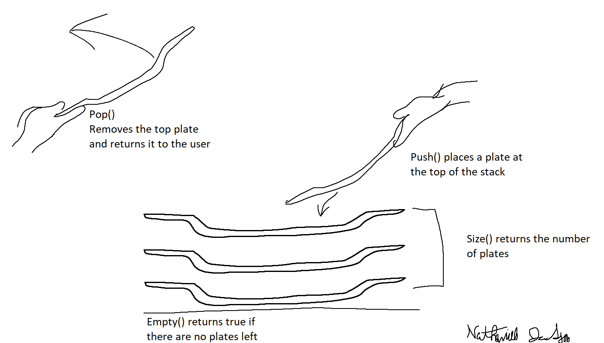

# Stacks
## Table of Contents
- [Introduction](#introduction)
- [Plate Analogy](#plate-analogy)
- [Common Uses](#common-uses)
- [Function Stacks](#function-stacks)
- [Common Operations](#common-operations)
- [Python Example](#python-example)
- [Problem Case](#problem-case)
- [Linked Lists & Trees](#continue-learning)

[**Welcome Page**](0-welcome.md)
## Introduction 
___
Stacks are a common data structure characterized by **Last in, First out** operation. A stack is an array that is only able to access elements from the very end. Whether new data is added or removed it will always be from the end of the structure, similar to a stack of plates in a cabinet.

Stacks in python can be implemented by using a list and only appending and popping data.

## Plate Analogy
___
You can think of a stack in programming like a stack of plates in a cabinet. Where the top of the plates is like the end of your Stack structure. You can place more plates on top of the stack and easily take the top plates off of the stack. Just like how trying to grab a plate from the middle can be extremely difficult without first removing the top plates, inserting or removing data from the middle of a stack is not allowed.

*Figure 1 - Stack of Plates*

*Figure 2 - Stack operations and plates*

## Common Uses
___
You may be wondering, "What are stacks used for?" Since stacks can only access data at the end of their structure they do not make good general storage arrays. However, stacks are excellent when tracking history. When I say history I could mean keeping a record of the last few actions a user has taken. This is common in Word processors and allows users to undo their actions. By recording the words a user types, the undo function can operate by "popping" or removing the last action from the stack. Similarly redoing can be achieved through use of a second stack that records each action that gets undone.

## Function stacks
___
Another common use of stacks are called function stacks. As a programmer this is likely the greatest interaction with stacks you will face. Function stacks are used to keep track of what function called another, allowing for the computer to easily switch back to the caller function. In other words, stacks are used in programming to tell the compiler/interpreter where to return to after a function is called. 

These stacks can become very large as software size increases. Most debuggers will display the current call/function stack so programmers can also see the relationship between caller and callee functions.

We can relate these function stacks to local variables, as variables within each function exist as part of the data within that element in the stack and are unable to access others without the use of global variables or class attributes. When a function is done running, it is removed from the stack and the data local to that function is removed with it. Local variables in the caller function will be maintained and unchanged by the callee function unless there was direct interaction between the two functions, like passing and appending values to a list.

This is also related to recursive functions where both the caller and callee are the same function. Function stacks are used to keep track of which instance of the function is active and extends until the end conditions are met. Once the end of the recursions is found the program will work backwards through the stack to return the computed output.
## Common Operations 
___
Operation   | Python Usage        | How does it work? | Efficiency
------------|---------------------|-------------------|-----------
push(value) | stack.append(value) | Inserts data at the end of the stack | O(1)
pop()       | stack.pop()         | Removes and returns the data at the end of the stack | O(1)
size()      | len(stack)          | Returns the length of the stack | O(1)
empty()     | if len(stack) == 0: | Returns True if the stack is empty | O(1)

As you can see above, while the operations of stacks are limited in that data can only be taken and added to the end, the operations that stacks can perform are extremely efficient in nature. They all have constant efficiencies, meaning that they will run just as quickly whether the stack has 1 element or 1000000.

## Python Example
___
Here is an example of a stack written in python. Along with an undo operation as an example of how stacks can be used.
- ### [**Stack Demo**](stacks-demo.py)
## Problem Case
Now get some practice with stacks yourself. Using the given Stack problem script:
1. Write a working redo operation using the Word() class. The problem 1 output should read "Testing the Redo Function" not "Testing the Function"
2. BONUS: Add code to reset the discard stack whenever more words are typed. Just as in Microsoft Office, redo operations only work if the last operation a user did was an undo. Further typing should stop the user from being able to restore values. 
3. BONUS: Add code to check if an undo or redo can be done. If history or discard are empty, print an error message so that an exception is not raised, but the program alerts the user that the operation is not possible.

You must complete both Bonus objectives to see proper output from the Bonus Problem test output.
- ### [**Stack Problem**](stacks-problem.py)
- ### [**Stack Solution**](stacks-solution.py)

Congratulations on learning more about stacks!

# Continue Learning
- ### [Linked Lists](2-topic.md)
- ### [Trees](3-topic.md)

[**Welcome Page**](0-welcome.md)