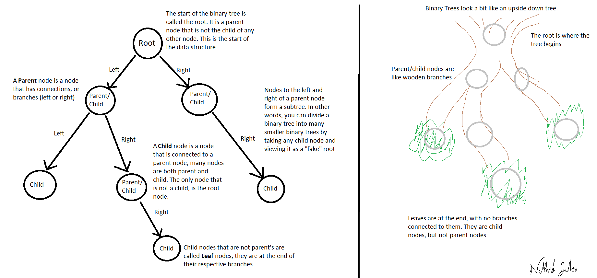
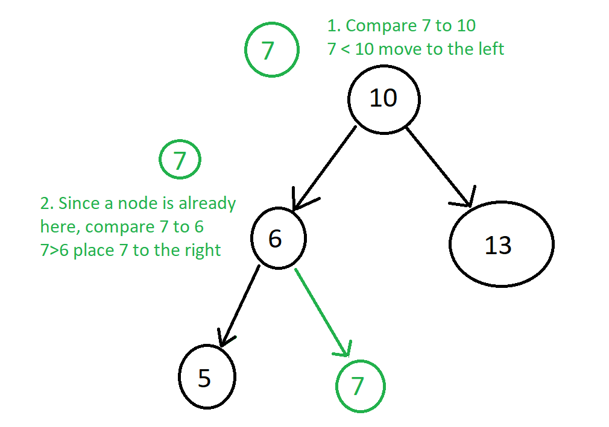
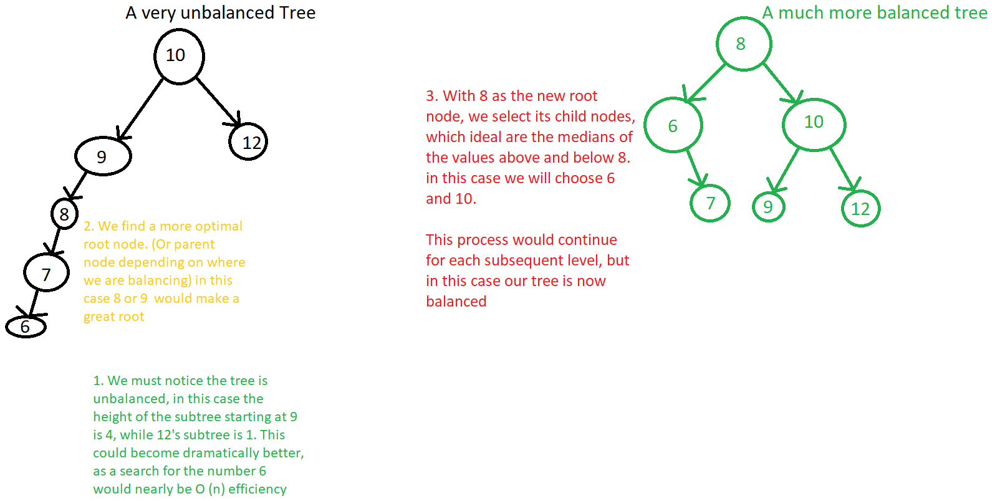

# Trees
## Table of Contents
- [Introduction](#introduction)
- [Binary Trees](#binary-trees)
- [Why Sort a Binary Tree?](#why-sort-a-binary-tree)
- [Problems with Binary Trees](#problems-with-binary-trees)
- [Methods to Balance Binary Trees](#methods-to-balance-binary-trees)
- [Common Operations](#common-operations)
- [Python Example](#python-example)
- [Stacks and Trees](#continue-learning)

[**Welcome Page**](0-welcome.md)
## </a>Introduction 
___
The final topic we shall discuss in this guide are Trees. Trees are another data structure, similar to linked lists, which connect nodes. The main difference being that instead of making a directional flow like linked lists, trees create many parent/child relationships. A node, the parent, can have several branching nodes, the children. 

Taken straight from this definition trees would be an extremely confusing mess, however, if we refine the rules for how child nodes are connected trees become much more useful.

## Binary Trees
___
Binary trees are one such refinement. A binary tree is a tree that links no more than two other nodes. In other words, each parent can only have 2 child nodes. One way to think about how the nodes are connected is to split the child nodes into a left node and a right node. Here is a picture that explains some of the terms associated with a binary tree.

As you can see, the structure of a binary tree is kind of similar to a real tree which is where terms like root, leaf and branch come from. Like linked lists, when binary trees are implemented child nodes also point to their parents.

## Why Sort a Binary Tree?
___
Binary trees are useful for many applications, especially search algorithms. However, one more rule must be followed to make a binary tree work really well for this case. We need to have it sorted and balanced.

**What is a Binary Search Tree?**

A sorted binary tree, also known as a Binary Search Tree (BST), is a binary tree that follows specific rules to place the data entered into it. It is easiest to think of this with integers as the data. When data is added to the tree, it will be compared to the parent node and if the data is less than the parent, it will be added to the left side. If it is greater than the parent node, it will be added to the right side. If there is already a node on the left/right side then the new data is compared to that node, continuing the process until it finds an endpoint.

By sorting the binary tree we now have a quick way to find new values. Search for the number 5 in the above list no longer has to look through each item in the list like an array, but simply makes the same comparisons and returns True after going left twice to find where the 5 is. If there is no value, lets say it is searching for 4, after it sees no nodes connected to 5 it will return False because if a four was added, it would have been in that position. The great benefit being that the search doesn't need to look at the 13 or 7 nodes. Ideally, a BST halves the potential nodes in a search every comparison.

## Problems with Binary Trees
___
Unfortunately, the extremely efficient search only occurs in idea conditions. In order to achieve the optimal search efficiency a tree must remain **balanced**. A binary tree is balanced when height of subtrees are approximately equal. In other words, the tree does not have any particularly long branches.

Without additional work, a binary search tree can easily become unbalanced. For example, using the picture above, if the next items added were 4,3,2,1 it would become extremely unbalanced as each of those would go to the left-most branch, extending far beyond the others. There are methods to correct an unbalanced tree, which will be discussed in the next section

Binary Trees, while useful in a few applications are pretty niche in use. While they are good for searches and finding data efficiently with approximately log n big O notation, they have extremely few operations faster than that. Care must be taken in case there is a more efficient data structure suited to your needs 

## Methods to Balance Binary Trees
___
Balancing a Binary Tree is all about selecting a more efficient node to become the parent and reorienting the child nodes to ensure the height of each set of subtrees remains approximately equal.

While the above picture explains the basic idea behind balancing a tree, there are much more efficient algorithms that computers can use to perform the balance or only balance particular subtrees that need to be reworked.

## Common Operations 
___
Operation   | Python Usage        | How does it work? | Efficiency
------------|---------------------|-------------------|-----------
insert(value)|bst.insert(value)|Inserts value into the tree|O(log n) 
remove(value)|bst.remove(value)|Removes value from tree|O(log n) 
contains(value)|bst.contains(value)|Returns True if value is in tree|O(log n) 
traverse_forward|bst.forward()| Moves through the tree from smallest to largest|O(log n) 
traverse_reverse|bst.reverse()|Moves through the tree from largest to smallest|O(log n) 
height(node)|bst.height()| Returns the height of the tallest branch|O(log n) 
size()|bst.size()| Returns the number of nodes in the tree|O(1) 
empty()|bst.empty()| Returns True if tree has no nodes|O(1)

Nearly every operation a binary tree performs requires a search through the nodes to determine where a value must be inserted, removed, checked, etc. Meaning almost every operation has O(log n) performance. While this is good performance for actions like searching, it could signifanctly impact performance when used in applications requiring inserting values frequently. Pros and cons need to be weighed before making any large decisions.

## Python Example
___
Here is a demo of a Binary Search Tree class written in python, here you can see the workings of a BST as well as my implementation of the size and empty methods.
- ### [**BST Demo**](tree-demo.py) 

Now get some practice with BSTs yourself. Using the given BST problem script:
1. Write a balance method for the BST. This method will take a BST and reorder its nodes to balance it. A good way to check how balanced a tree is, is to use the get_height method

- Note: This BST python class does not support duplicate values and this task is easier using existing methods.
- ### [**BST Problem**](tree-problem.py)
- ### [**BST Solution**](tree-solution.py)

Congratulations on learning more about Trees!

# Continue Learning
- ### [Stacks](1-topic.md)
- ### [Linked Lists](2-topic.md) 

[**Welcome Page**](0-welcome.md)